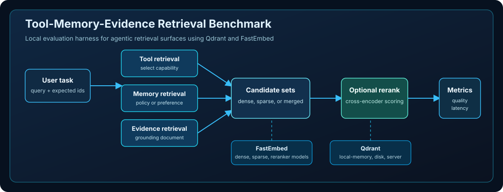
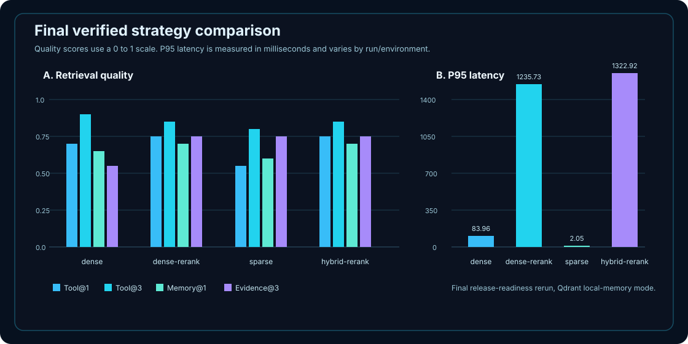

# Tool-Memory-Evidence Retrieval Benchmark

A local-first benchmark for evaluating retrieval quality inside agentic workflows across tools, memories, and grounding evidence.




Classic RAG evaluation asks whether a system retrieved the right document. Agentic systems also need to select the right tool, apply the right durable memory or policy, and retrieve the right evidence before acting. This benchmark makes those retrieval targets measurable with Qdrant, FastEmbed, a small synthetic dataset, and reproducible local commands.

Current status: runnable local benchmark with validated dense, sparse, rerank, and hybrid-rerank strategies.

## Quickstart

The recommended path uses Qdrant `local-memory` mode, which does not require Docker.
Requires Python 3.10+. Using a virtual environment is recommended.

```powershell
python -m venv .venv
.\.venv\Scripts\Activate.ps1
pip install -r requirements.txt
python -m pytest
python -m app.evaluate --strategy dense --qdrant-mode local-memory --recreate-collections --write-report reports/agentic_retrieval_results.md
```

The benchmark is local-first, but first-run FastEmbed model downloads may require network access unless the required model files are already cached.

## Why This Exists

Document-only retrieval can hide failures that matter in agentic systems. A workflow may find a relevant document while selecting the wrong tool, skipping a required policy memory, or grounding the final answer in weak evidence.

This project isolates those retrieval decisions so quality and latency trade-offs are visible without building a full agent framework.

## What The Benchmark Measures

| Retrieval surface | Question answered | Example target |
| --- | --- | --- |
| Tool | Did the system select the right callable capability? | `tax_validator` |
| Memory | Did it retrieve the right policy, preference, or durable instruction? | `human_approval_policy` |
| Evidence | Did it retrieve the right grounding document or note? | `invoice_tax_rules` |

Core metrics:

- `Tool@1`
- `Tool@3`
- `Memory@1`
- `Evidence@3`
- mean latency
- P95 latency
- gain versus dense baseline where applicable

## Strategies

| Strategy | Description | Expected trade-off |
| --- | --- | --- |
| `dense` | FastEmbed dense embeddings searched in Qdrant | Strong semantic baseline |
| `dense-rerank` | Dense candidates reranked with a FastEmbed cross-encoder | Better top-rank quality, higher latency |
| `sparse` | FastEmbed sparse BM25-style vectors searched in Qdrant | Very fast exact-term matching |
| `hybrid-rerank` | Dense and sparse candidates merged, deduplicated, then reranked | Strong quality, more moving parts |

## Verified Results

Final release-readiness rerun in Qdrant `local-memory` mode:

| Strategy | Tool@1 | Tool@3 | Memory@1 | Evidence@3 | Mean ms | P95 ms |
| --- | ---: | ---: | ---: | ---: | ---: | ---: |
| dense | 0.700 | 0.900 | 0.650 | 0.550 | 61.46 | 83.96 |
| dense-rerank | 0.750 | 0.850 | 0.700 | 0.750 | 1123.66 | 1235.73 |
| sparse | 0.550 | 0.800 | 0.600 | 0.750 | 1.52 | 2.05 |
| hybrid-rerank | 0.750 | 0.850 | 0.700 | 0.750 | 1099.49 | 1322.92 |



Latency is run- and environment-sensitive. The values above are the final verified local-memory rerun for this repository state.

## Key Findings

- Dense gives the strongest Tool@3 with moderate latency.
- Sparse is extremely fast and improves Evidence@3, but hurts Tool@1.
- Reranking improves Tool@1, Memory@1, and Evidence@3, but adds significant latency.
- Hybrid-rerank matches rerank quality in this run, while still remaining latency-heavy.
- Evidence retrieval remains below the original demonstration target, which is a useful failure-mode signal rather than something to tune away by changing labels.

## Run More Strategies

```powershell
python -m app.evaluate --strategy dense --qdrant-mode local-memory --recreate-collections --write-report reports/agentic_retrieval_results.md
python -m app.evaluate --strategy dense-rerank --qdrant-mode local-memory --recreate-collections --write-report reports/agentic_retrieval_results.md
python -m app.evaluate --strategy sparse --qdrant-mode local-memory --recreate-collections --write-report reports/agentic_retrieval_results.md
python -m app.evaluate --strategy hybrid-rerank --qdrant-mode local-memory --recreate-collections --write-report reports/agentic_retrieval_results.md
```

Optional rerank candidate count:

```powershell
python -m app.evaluate --strategy dense-rerank --candidate-k 10 --qdrant-mode local-memory --recreate-collections --write-report reports/agentic_retrieval_results.md
```

## Architecture Overview

The benchmark loads JSONL data, validates ground-truth target ids, embeds retrievable items with FastEmbed, creates Qdrant collections, retrieves candidates for each surface, optionally reranks them, computes metrics, and writes a report.

See [Architecture](docs/ARCHITECTURE.md) for the detailed component map and execution flow.

## Local And Restricted-Network Execution

`local-memory` is the default path because it avoids Docker and server setup:

```powershell
python -m app.evaluate --strategy dense --qdrant-mode local-memory --recreate-collections --write-report reports/agentic_retrieval_results.md
```

Docker/server mode is optional:

```powershell
docker compose up -d
python -m app.evaluate --strategy dense --qdrant-mode server --qdrant-url http://localhost:6333 --recreate-collections --write-report reports/agentic_retrieval_results.md
```

Restricted networks may block Docker Hub or related image-pull infrastructure. The benchmark is local-first, but first-run FastEmbed model downloads may require network access unless the required model files are already cached. Fully offline execution requires dependencies and model files to already be available locally.

Default models:

- dense: `BAAI/bge-small-en-v1.5`
- sparse: `Qdrant/bm25`
- reranker: `Xenova/ms-marco-MiniLM-L-6-v2`

This benchmark does not require OpenAI, Anthropic, external LLM APIs, paid APIs, or cloud services.

## Documentation

- [Architecture](docs/ARCHITECTURE.md)
- [Results interpretation](docs/RESULTS_INTERPRETATION.md)
- [Offline and restricted network notes](docs/OFFLINE_AND_RESTRICTED_NETWORK_NOTES.md)
- [Future PR plan](docs/FUTURE_PR_PLAN.md)
- [Benchmark report](reports/agentic_retrieval_results.md)

The upstream discussion draft is kept locally for human review and is not part of the public repository.

## What This Is / Is Not

| This is | This is not |
| --- | --- |
| A local benchmark for agentic retrieval surfaces | A full agent framework |
| A synthetic evaluation harness | A scientific leaderboard |
| A Qdrant/FastEmbed example candidate | An official Qdrant project |
| A no-external-LLM benchmark | An OpenAI/Anthropic app |
| A small methodology artifact for review | A claim that one strategy is generally best |

## Limitations

- The dataset is small and synthetic.
- Results are methodology/demo results, not scientific or leaderboard claims.
- Latency varies by hardware, run order, model loading, and cache state.
- FastEmbed model downloads may occur on first run.
- Evidence retrieval still needs future analysis because the best verified Evidence@3 is 0.750, below the original demonstration target.

## License

MIT License. See [LICENSE](LICENSE).

## Future Upstream Plan

The first upstream step should be a Qdrant/FastEmbed GitHub Discussion, not a large unsolicited PR. The discussion should ask whether maintainers would find this useful as a docs example or experimental benchmark and where they would prefer it to live.

The intended upstream contribution would likely be a trimmed docs/example or experiments artifact, not this full repository.

## Disclaimer

This repository is an independent benchmark project using Qdrant and FastEmbed. It is not official, endorsed, or approved by Qdrant/FastEmbed maintainers unless they explicitly say so in the future.
